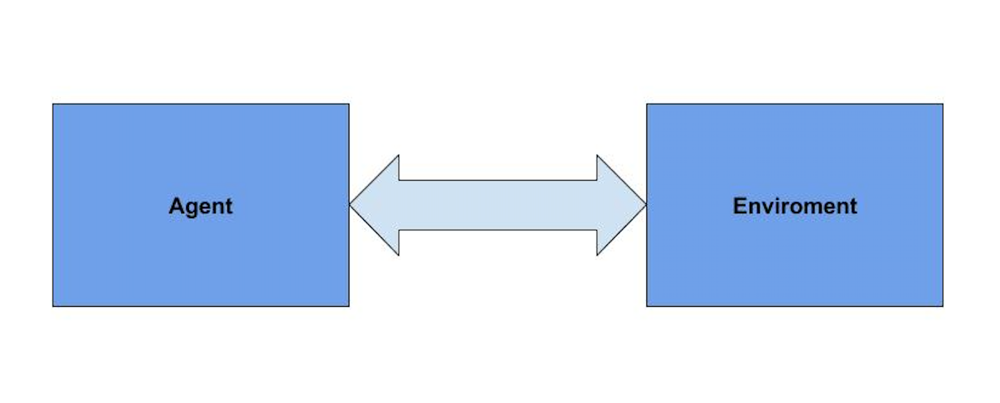

# DeepLearning Trader

The purpose of this project is to make a neural network model which buys and sells in the stock or a similar system like forex market.

# how it works :

“Reinforcement learning” is a technique to make a model (a neural network) which acts in an environment and tries to find how to “deal” with that environment to get the maximum “reward”.

“Agent” produces action and earn reward for that action from the environment and updates itself with that reward to produce better actions in the future.

In this situation back trader is the environment, which simulates stock or forex market with real data history.

For example, single row of data frame includes:
[Open, High, Low, Close, Volume]

Action produced by our model in a specific state is a decision to buy or sell. Back trader calculates and returns a reward for every action made by the model.

If we buy, that means price will increase and if we sell that means price will be decrease.

PPO is a technique in reinforcement learning. In this technique two different models feeds back to one another to achieve a better result.

To improve the model training and maximizing performance in an agent, two different models act together and feedback each other.

It’s like different people working in a single team.

“Critic” predicts the maximum reward that can be earned from this situation base on the latest experience.
“Actor” predicts the best action in that situation which led to maximum reward.

These two work in parallel and feedback each other to have a better grasp of the present state.

Please refer to these links for more information on this subject:
https://www.youtube.com/watch?v=e3Jy2vShroE&t=125s
https://www.youtube.com/watch?v=5P7I-xPq8u8&t=7s

# Achievements on This Version:
This is not the last version we’re working on it and also this model cannot achieve human level performance. Since this model is based on LSTM, it is not capable to achieve a better performance.

because model is LSTM based and havent capable to achive more 

Latest Achievements
Changing the model from LSTM to attention base, fixes the problem of data normalization. Also we’ve added more indicators, introduced data visualization and a back trader buy-sell history.

# Future Goals:

We are going to eliminate all the LSTM from the model.

Also, having multiple models at once and train them in parallel (instead of training one model at once) will make the overall progress much faster.

# Motivation for sharing this project:
It’s about a year that we’re working on this project. We’ve found that it’s like a full time job and we need more expertise in other fields to make this project really successful.
For instance, an experienced scientist in Algotrading (Algorithmic Trading) would be very helpful for us to determine which indicators are useful and how to use them.
For this reason, we are looking for investors so we could hire more people to fuel the project.

Contact me at LinkedIn: https://www.linkedin.com/in/sina-pournia-74246a185/

