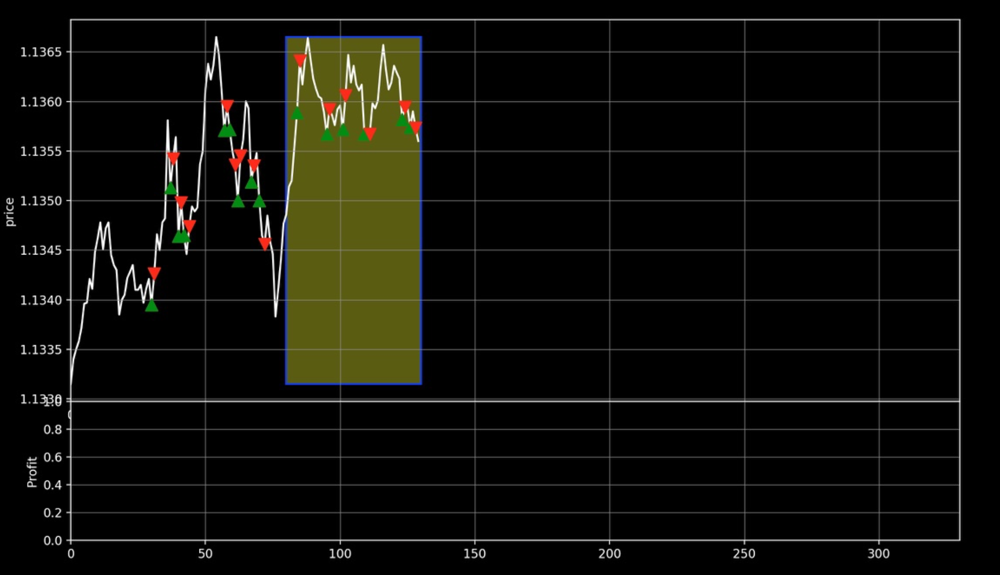

# DeepLearning Trader

the porpuse of this project is make a neural network model to buy and sell in stock or forex market 

# how it works :

Reinforcement learning ==> its a technique to make a model ( a neural network ) witch act with enviroment and try to find out how treat with enviroment to get maximum reward  

agent produce action and get reward for given action from enviroment and updated it self with that reward for produce better action

So in our situation backtrader is enviorment, witch simulates stock or forex market with real data history 

for example single row of data frame included :

[Open,High,Low,Close,Volume]

then action given by model in that state to decide buy or sell 
backtrader calculate and return reward for that action

if we buy that means price will increase and if we sell that means price will be decrease 

PPO ==> its technique inside reinforcement learning field 
there is two different model whitch feedbacks each other to achive better result 

for train model better and maximize performance inside agent two model acts together and feedback each other.

its like two people in one team,

Critic => predict the maximum reward can get from this situation base on latest experince 
Actor  => predict the best action in that situation which leads to maximum reward 

this two works parallel and feedback each other to have a better sight for present state 

for more information : 
https://www.youtube.com/watch?v=e3Jy2vShroE&t=125s

for more information : 
https://www.youtube.com/watch?v=5P7I-xPq8u8&t=7s

# this version acvhivment :
this version is not last version im working on it and this model cant achive human level performance

because model is LSTM based and havent capable to achive more 

# last version achivement :
change the model from LSTM to attention base
fix problem of normalization data
add More indicators 
visualize Data and Backtrader buy sell history 

# next Goals 

still have LSTM inside the model trying to eliminate it

make different models train parallel all together for make all progress faster (instead of training one model in one itteration)

# Motivation for sharing this project 

its about one year im working on this project but after all I find out it should be a fulltime job with some other people in other fields to make project sucsesful 

for example at least should work with someone who works in algotrading field will be so helpfull to find out witch indicator usefull and how 

in this porpuse im looking for some investors to hire people and make situation for working together on this porject

contact 
linkedIn:

